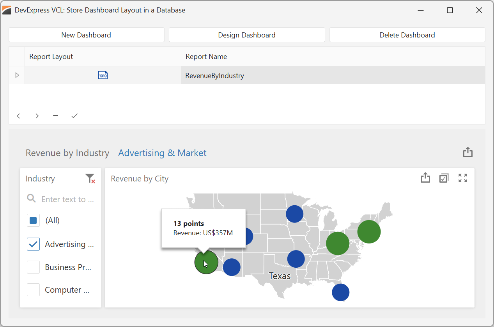
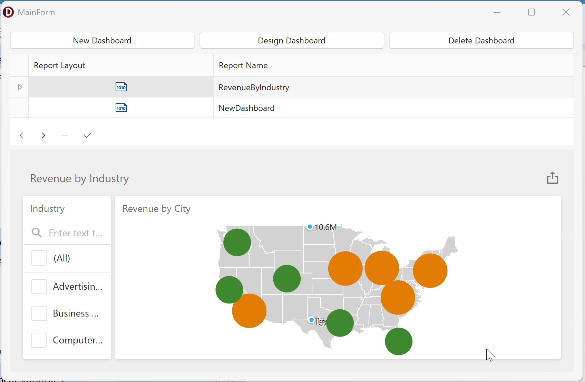
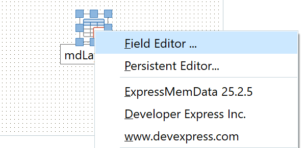
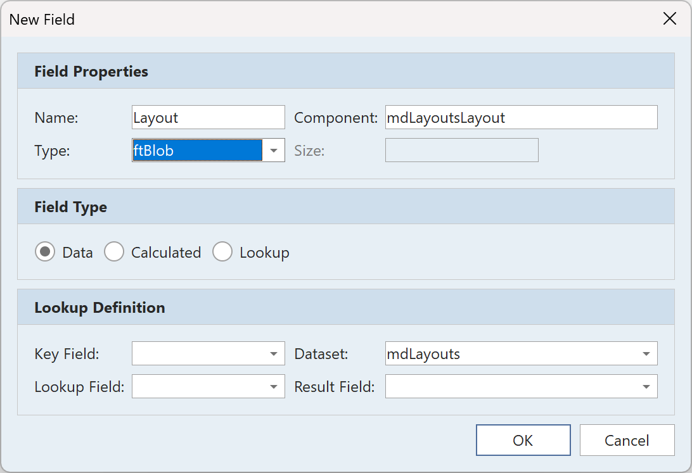
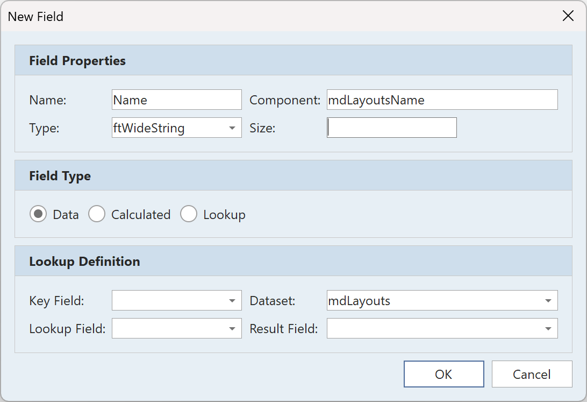
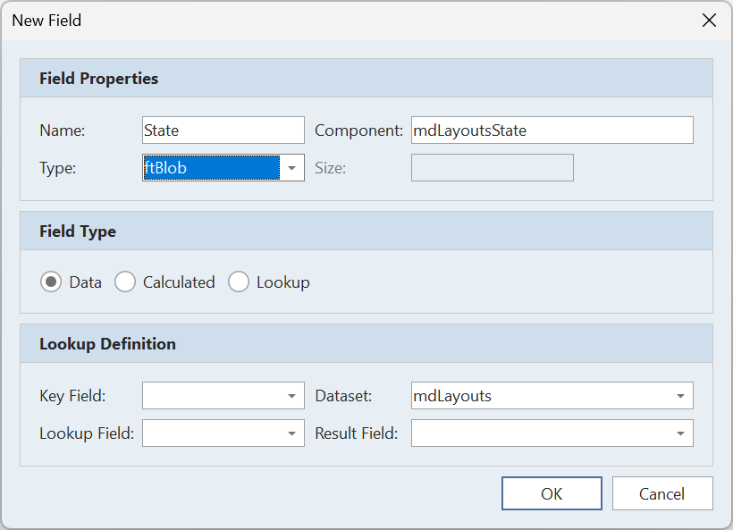
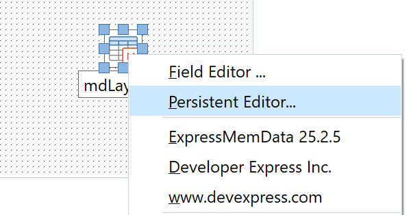

<!-- default badges list -->

[](https://supportcenter.devexpress.com/ticket/details/T1318109)
[](https://docs.devexpress.com/GeneralInformation/403183)
[](#does-this-example-address-your-development-requirementsobjectives)
<!-- default badges end -->

# DevExpress Dashboards for Delphi/C++Builder — Store Dashboard Layouts and User Interaction State in a Database

This example application allows users to create new layouts/modify existing layouts
(using the built-in Dashboard Designer), interact with dashboard UI elements, and save
[state][TdxCustomDashboardControl.State] or [layout][TdxCustomDashboardControl.Layout] changes to the data source.




## Prerequisites

[DevExpress Dashboards Prerequisites][req]

[req]: https://docs.devexpress.com/VCL/405773/ExpressCrossPlatformLibrary/vcl-backend/reports-dashboards-app-deployment#vcl-reportsdashboards-prerequisites


## Test the Example

1.  Run the sample app.
1.  Click **New Dashboard** to create a new dashboard or **Design Dashboard** to modify the pre-defined dashboard.
1.  Create or modify the dashboard layout using tools available within the UI.
1.  Click the hamburger button, select the **Save** option, and close the dialog.
1.  Create additional layouts if necessary. 
1.  Close and restart the app.
1.  Click on grid records to switch between dashboard layouts you set up previously.
    Click **Design Dashboard** or **Delete Dashboard** to modify or delete entries. 




## Implementation Details

The example stores dashboard layouts using a DevExpress memory-based dataset ([TdxMemData]).
You can modify the application to use any other [TDataSet] descendant instead.
To review our data module implementation, see the following file: [uData.pas]/[uData.cpp].

The instructions assume that you start with a Delphi or C++Builder project that already includes
a configured data source for DevExpress Dashboards.
This example application uses a memory-based dataset as the dashboard's data source
(see `mdRevenueByIndustry` in the data module).
To configure a dashboard data source in your project, refer to the following tutorial:
[Create a dashboard using the Designer Dialog][designer].

### Step 1: Create a Dataset to Store Dashboard Layout and State Data

1.  Add a [TdxMemData] component to the data module (`mdLayouts` in the example).
1.  Add a [TDataSource] component to the data module (`dsLayouts` in the example). 
    Assign the previously created dataset component to `TDataSource.DataSet`:

    > 

1.  Open the context menu for the dataset component and select **Field Editor…**:
    
    > 

1.  Click **Add…** to create a BLOB field ([ftBlob]) for layout data:

    > 

1.  Click **Add…** to create a string field ([ftWideString]) for layout names:

    > 

1.  Click **Add…** to create another BLOB field for dashboard states:

    > 

1.  (*Optional*) Preload persistent data to the dataset to make layouts available in the application upon first launch.

    This example includes a sample dashboard layout that displays revenue data from an included dataset.
    You can preload dashboard layout and data from [layout.dat] and [revenue.dat], respectively.
    Open the context menu for the dataset component, select **Persistent Editor…**, click **Load…**, and select the file.
    
    > 

    Alternatively, you can use the Dashboard Designer later to import dashboard data from an XML file.


## Step 2: Load a Dashboard Layout Definition

To load a layout definition to the Dashboard Control ([TdxCustomDashboardControl]), you must specify
dashboard name ([TdxCustomDashboardControl.DashboardName]), layout ([TdxCustomDashboardControl.Layout]),
and, optionally, dashboard user interaction state ([TdxCustomDashboardControl.State]):

<!-- start-code-block -->
#### Delphi

```delphi
procedure TMainForm.LoadLayoutDefinition;
begin
  // Ensure that the dataset has at least one record or a new record is being created
  if (DataModule1.mdLayouts.RecordCount = 0) and (DataModule1.mdLayouts.State <> dsInsert) then
  begin
    dxDashboardControl1.Clear;
    Exit;
  end;
  // Load dashboard name and layout from the database
  dxDashboardControl1.DashboardName := DataModule1.mdLayoutsName.AsString;
  dxDashboardControl1.Layout.Assign(DataModule1.mdLayoutsLayout);
  // Load a dashboard state if it is stored in the database
  if not DataModule1.mdLayoutsState.IsNull then
    dxDashboardControl1.State.Assign(DataModule1.mdLayoutsState);
  // Activate the dashboard control
  dxDashboardControl1.Active := True;
end;
```
<!-- end-code-block -->

To load a different dashboard in the Dashboard Control, assign a new dashboard name and layout.
The assigned layout definition replaces the current definition and resets the dashboard state.

You can also clear the Dashboard Control using [TdxCustomDashboardControl.Clear].
The `Clear` function disables the `TdxCustomDashboardControl.Active` property.
Once you assign a new dashboard layout (and, optionally, a UI interaction state),
you must activate the dashboard control.


<!-- start-code-block -->
#### Delphi
```delphi
  dxDashboardControl1.Active := True;
```
<!-- end-code-block -->

### Step 3: Display the Dashboard Designer

Once you assign a dashboard layout definition to the Dashboard Control,
you can display the [Dashboard Designer][designer] dialog:

<!-- start-code-block -->
#### Delphi

```delphi
procedure TMainForm.btnDesignClick(Sender: TObject);
begin
  dxDashboardControl1.ShowDesigner; // Displays the Dashboard Designer
end;
```
<!-- end-code-block -->

### Step 4: Store Dashboard State in a Dataset

When a user interacts with the dashboard in the Dashboard Control or Designer,
the value of [TdxCustomDashboardControl.State] changes and an
[OnStateChanged][TdxCustomDashboardControl.OnStateChanged] event is called.
Handle this event to save dashboard state changes to the database.

<!-- start-code-block -->
#### Delphi

```delphi
procedure TMainForm.dxDashboardControl1StateChanged(
  ASender: TdxCustomDashboardControl);
begin
  // Start editing the active dataset record
  DataModule1.mdLayouts.Edit;

  // Save the current dashboard state to the active record
  DataModule1.mdLayoutsState.Assign(dxDashboardControl1.State);

  // Finish editing and post the modified record to the database
  DataModule1.mdLayouts.Post;
end;
```
<!-- end-code-block -->

### Step 5: Store Dashboard Layouts in a Dataset

When a user edits and saves a dashboard in the Dashboard Designer,
the value of [TdxCustomDashboardControl.Layout] changes and an
[OnLayoutChanged][TdxCustomDashboardControl.OnLayoutChanged] event is called.
Handle this event to save layout changes to the database.

<!-- start-code-block -->
#### Delphi

```delphi
procedure TMainForm.dxDashboardControl1LayoutChanged(
  ASender: TdxCustomDashboardControl);
begin
  if DataModule1.mdLayoutsName.AsString <> dxDashboardControl1.DashboardName then
  begin
    // Create and start editing a new dataset record
    DataModule1.mdLayouts.Append;
    DataModule1.mdLayoutsName.AsString := dxDashboardControl1.DashboardName;
  end
  else
    // Start editing the active dataset record
    DataModule1.mdLayouts.Edit;

  // Save the dashboard layout to the database
  DataModule1.mdLayoutsLayout.Assign(dxDashboardControl1.Layout);
  // Finish editing and post the modified record to the database:
  DataModule1.mdLayouts.Post;
end;
```
<!-- end-code-block -->

### Step 6: Persist Data between Application Sessions

This step is applicable only to the memory-based [TdxMemData] datasource.

To save the dataset to a file and restore data on app restart,
handle `OnCreate` and `OnDestroy` events of the data module:

<!-- start-code-block -->
#### Delphi

```delphi
const
  DataFileName = 'data.dat';

procedure TDataModule1.DataModuleCreate(Sender: TObject);
begin
  if FileExists(DataFileName) then
    mdLayouts.LoadFromBinaryFile(DataFileName)
end;

procedure TDataModule1.DataModuleDestroy(Sender: TObject);
begin
  if mdLayouts.RecordCount > 0 then
    mdLayouts.SaveToBinaryFile(DataFileName)
end;
```
<!-- end-code-block -->

## Files to Review

- [uData.pas]/[uData.cpp] — stores dashboard layouts and supplies data to the dashboard.
- [uMainForm.pas]/[uMainForm.cpp] — loads dashboard layouts from the data module
  and displays Dashboard Control and Dashboard Designer.
- [layout.dat] and [revenue.dat] — store memory-based dataset states you can load to reproduce this example.
- [data.dat] — stores the memory-based dataset state between application sessions.


## Documentation

-   [Introduction to DevExpress Dashboards for Delphi/C++Builder][dashboards-intro]
-   [Tutorial: Create a dashboard using the Designer Dialog][designer]
-   [Reports/Dashboards for Delphi/C++Builder: Supported Database Systems][supported-dbms]
-   [Save the dashboard layout to file on every change (code example)][save-to-file]
-   API reference:
    -   [TdxCustomDashboardControl] (used to display a dashboard on an application form)
    -   [TdxCustomDashboardControl.State] (a JSON-based dashboard state you can store in a BLOB dataset field)
    -   [TdxCustomDashboardControl.Layout] (an XML-based layout template you can store in a BLOB dataset field)
    -   [TdxCustomDashboardControl.DashboardName] (internal dashboard name that is not included in the layout or state)
    -   [TdxCustomDashboardControl.OnStateChanged] (event called when a user interacts with a dashboard and changes its state)
    -   [TdxCustomDashboardControl.OnLayoutChanged] (event called when a user edits and saves a dashboard in the Dashboard Designer)
    -   [TdxMemData] (DevExpress in-memory dataset implementation)
    -   [TDataSet] (contains generic database connection methods)
    -   [TdxBackendDataSetJSONConnection] (supplies data to dashboards)


<!-- documentation links -->

[dashboards-intro]: https://docs.devexpress.com/VCL/405642/ExpressDashboards/vcl-dashboards
[designer]: https://docs.devexpress.com/VCL/405774/ExpressDashboards/getting-started/create-dashboard-using-designer-dialog
[supported-dbms]: https://docs.devexpress.com/VCL/405703/ExpressCrossPlatformLibrary/vcl-backend/vcl-backend-supported-database-systems
[save-to-file]: https://docs.devexpress.com/VCL/dxDashboard.Control.TdxCustomDashboardControl.Layout#save-dashboard-layout-to-file-on-every-change
[supported-dbms]: https://docs.devexpress.com/VCL/405703/ExpressCrossPlatformLibrary/vcl-backend/vcl-backend-supported-database-systems

<!-- reference links -->
[TdxCustomDashboardControl]: https://docs.devexpress.com/VCL/dxDashboard.Control.TdxCustomDashboardControl
[TdxCustomDashboardControl.Clear]: https://docs.devexpress.com/VCL/dxDashboard.Control.TdxCustomDashboardControl.Clear
[TdxCustomDashboardControl.DashboardName]: https://docs.devexpress.com/VCL/dxDashboard.Control.TdxCustomDashboardControl.Layout
[TdxCustomDashboardControl.Layout]: https://docs.devexpress.com/VCL/dxDashboard.Control.TdxCustomDashboardControl.Layout
[TdxCustomDashboardControl.State]: https://docs.devexpress.com/VCL/dxDashboard.Control.TdxCustomDashboardControl.State
[TdxCustomDashboardControl.OnLayoutChanged]: https://docs.devexpress.com/VCL/dxDashboard.Control.TdxCustomDashboardControl.OnLayoutChanged
[TdxCustomDashboardControl.OnStateChanged]: https://docs.devexpress.com/VCL/dxDashboard.Control.TdxCustomDashboardControl.OnStateChanged
[TdxBackendDataSetJSONConnection]: https://docs.devexpress.com/VCL/dxBackend.ConnectionString.JSON.DataSet.TdxBackendDataSetJSONConnection
[TdxMemData]: https://docs.devexpress.com/VCL/dxmdaset.TdxMemData


<!-- external documentation links -->
[TDataSet]: https://docwiki.embarcadero.com/Libraries/Athens/en/Data.DB.TDataSet
[TDataSource]: https://docwiki.embarcadero.com/Libraries/Athens/en/Data.DB.TDataSource
[ftString]: https://docwiki.embarcadero.com/Libraries/Athens/en/Data.DB.TFieldType
[ftWideString]: https://docwiki.embarcadero.com/Libraries/Athens/en/Data.DB.TFieldType
[ftBlob]: https://docwiki.embarcadero.com/Libraries/Athens/en/Data.DB.TFieldType


<!-- in-repository links -->
[uData.pas]: ./Delphi/uData.pas
[uData.cpp]: ./CPB/uData.cpp
[data.dat]: ./Delphi/data.dat
[layout.dat]: ./layout.dat
[revenue.dat]: ./revenue.dat
[uMainForm.pas]: ./Delphi/uMainForm.pas
[uMainForm.cpp]: ./CPB/uMainForm.cpp


## More Examples

-   [Pass Hidden Parameters to a SQL Query][hidden-parameter-example]
-   [Generate Dashboards in a Backend / Service Application][non-interactive-example]
-   [Store Layouts in XML Files (DevExpress Reports for Delphi/C++Builder)][file-example]

[hidden-parameter-example]: https://github.com/DevExpress-Examples/vcl-dashboards-pass-hidden-parameters-to-custom-sql-query
[file-example]: https://github.com/DevExpress-Examples/vcl-reports-store-layout-template-file
[non-interactive-example]: https://github.com/DevExpress-Examples/vcl-reports-store-layout-template-database

<!-- feedback -->
## Does This Example Address Your Development Requirements/Objectives?

[](https://www.devexpress.com/support/examples/survey.xml?utm_source=github&utm_campaign=vcl-dashboards-store-layout-template-database&~~~was_helpful=yes) [](https://www.devexpress.com/support/examples/survey.xml?utm_source=github&utm_campaign=vcl-dashboards-store-layout-template-database&~~~was_helpful=no)

(you will be redirected to DevExpress.com to submit your response)
<!-- feedback end -->
